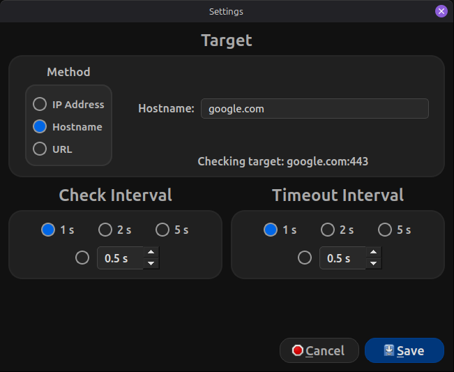

# Network Monitor

Desktop Python application (PySide6) that monitors **reachability of a target** via TCP and tracks network metrics.
When the target can't be reached, it uses a **fallback probe** to distinguish "no internet connectivity" from "target not reachable".

## Screenshots

<h3 align="center">Online</h3>
<p align="center">
    
</p>

<h3 align="center">Unreachable</h3>
<p align="center">
    
</p>

<h3 align="center">Offline</h3>
<p align="center">
    
</p>

<h3 align="center">Settings</h3>
<p align="center">
    
</p>

# How It Works

The app performs a TCP connection attempt to a configured target:

- **Online**: Target reachable
- **Unreachable**: Target not reachable, but a known-good endpoint is reachable (internet is stable, target is the issue)
- **Offline**: Target and known-good endpoints are unreachable (most likely no internet connectivity)

Latency is measured as the TCP connect time (when `Online`).

## Features

- Three status states: **Online / Offline / Unreachable**
- Configurable target:
    - IP Addresses (`IPv4/IPv6`)
    - Hostnames (e.g., `google.com`)
    - URLs (e.g., `https://www.google.com/`) - Normalized to host:port
- Configurable check interval and timeout (preset radio buttons and optional custom values)
- Metrics:
    - Server (target)
    - Phase: **Online for / Offline for / Unreachable for**
    - Latency (when `Online`)
    - Disconnect count
    - Total uptime / Total downtime
- Visual Indicators via `QSS`:
    - Status pill styling for all three states (Online/Offline/Unreachable)
    - Server pill remains blue
    - Severity styling for latency and disconnects
- Status tooltip (hover) with detailed information

## Tech Stack

- Python 3.11+
- PySide6 (Qt for Python)
- Background worker thread for network checks
- QSettings for persisted configuration
- QSS for styling

## Architecture Notes (v0.8.0)

The monitoring implementation is layered for clarity and testability:

- `services/monitor/probe.py`: Performs TCP connect attempts via `try_connect`
- `services/monitor/engine.py`: Contains logic and returns a `CheckResult`
- `ui/workers/monitor_thread.py`: Runs a `QThread` loop and emits results back to the UI
- `core/monitor/state.py`: Tracks the state of the monitoring metrics

## Setup

### Option A: uv (Recommended)

```bash
uv sync
```

Run with:
```bash
uv run network-monitor
```

### Option B: venv & pip

```bash
python3 -m venv .venv
source .venv/bin/activate
python3 -m pip install --upgrade pip
python3 -m pip install -e .
```

## Run

```bash
network-monitor
```

Alternatively, run it as a module:
```bash
python -m network_monitor
```

## Roadmap

- [x] Configurable target (host:port) and interval/timeout (implemented in [v0.2.0](#v020))
- [x] Multiple state connectivity: Online/Offline/Unreachable (implemented in [v0.5.0](#v050))
- [x] UI polish (layout and visual indicators)
- [x] Implement target method in settings (implemented in [v0.6.0](#v060))
- [x] Tooltips for all metrics (more detailed informations) (implemented in [v0.6.1](#v061))
- [ ] Click-to-copy full target (URL) from the server pill
- [ ] Light/Dark themes (started implementation in [v0.7.0](#v070))
- [ ] Taskbar Functionality
- [ ] Ability to resize application window
- [ ] Disconnect debounce (reduce false disconnects)
- [ ] Start / Stop monitoring controls
- [ ] Latency statistics (min/avg/max over last N checks)
- [ ] History Viewing (recent checks table)
- [ ] Profiles (switch between configurations more easily)

## Bugs (fixed)

- [x] Statistics keep resetting on status change (fixed in [v0.3.1](#v031))
- [x] Disconnects aren't being incremented/tracked (fixed in [v0.3.2](#v032))
- [x] When changing interval checks and timeout checks, the current phase resets (fixed in [v0.4.0](#v040))

## Changelog
### v0.1.0
Initial working GUI with TCP connectivity checks (`1.1.1.1:443`) and basic network statistics.

### v0.2.0
Added a settings dialog to configure the target:
- Server IP
- Port

Added selectable monitoring parameters:
- Check interval (preset radio buttons and optional custom values)
- Timeout (preset radio buttons and optional custom values)

Settings persist between launches.

### v0.3.0
Fixed an issue where configurations weren't persistent.

Improved UI
- Metric rows
- Statistics are now in green, pills
- Tightened the spacing surrounding the settings button and status

### v0.3.1
Fixed issue where the metrics were being reset to default when changing settings.

### v0.3.2
Fixed issue where disconnects wasn't functioning properly.

### v0.3.3
Disconnect severity coloring:
- 0: Green
- 1 - 9: Yellow
- 10+: Red

### v0.3.4
Similar to [v0.3.3](#v033), latency severity coloring:
- <100ms: Green
- 100 - 199ms: Yellow
- 200+ms: Red

### v0.3.5
Layout refactor and additional UI polishing.

### v0.4.0
Fixed issue where the uptime/downtime was resetting when changing endpoints.
- Phase timers are now preserved on setting change

### v0.5.0
Added a third connectivity state: `Unreachable`
- Uses a fallback probe to distinguish `Offline` (no internet connectivity) from `Unreachable` (internet is stable, target is the issue)

Settings now accepts three methods for configuring a target
- IP Addresses (IPv4/IPv6)
- Hostnames (`google.com`)
- URLs (e.g., `https://www.google.com/`)

Updated UI and styling to support the **Server Unreachable** state 

Added a status tooltip (hover) with extra details

### v0.6.0
Added
- Target Method selection in Settings: **IP Adress, Hostname, or URL**
- Hostname input now supports `host[:port]` (port defaults to 443 if omitted)
- URL input supports full URLs
- Server pill now displays a "clean" target
    - Hides default ports for Hostname/URL unless explicitly provided

Changed
- Server pill text handling
    - Long targets are now middle-elided to prevent UI breaking
    - Full target available on hover

Fixed
- Prevented long hostnames from breaking the layout
- Improved target validation in settings

### v0.6.1
Added
- Shared tooltip system for the UI (`tooltips.py`) with centralized tooltip text for both the monitor metrics and the settings fields.
- Hover tooltips across the monitor view and settins dialog for cleaner, in-application explanations.
- Support for storing a "full target" string for URL targets so long URLs can be shown on hover.

Changed
- URL target parsing now explicitly supports only `http` and `https` schemes and handles invalid ports more safely.
- Hostname validation updated to allow single-label hostnames (device names) that do not contain a dot.

Fixed
- Hostname targets no longer incorrectly require a `.` to be considered valid (e.g., `romanjay-srv` now works).

### v0.7.0
Added
- Theme System:
    - `base.qss`: Shared structure/layout
    - `dark.qss`: Dark theme
    - `light.qss`: Light theme (**WORK IN PROGRESS**)
- ThemeManager:
    - Centralized theme loading to prepare for the themes
- Live QSS reload (`*.qss` changes update the UI when saved)

Changed
- Replaced labels with section titles
- Completely new settings layout
- Settings now is able to be styled and match the theme with the rest of the application
- Consistent pill styling
    - Application only has a dark theme at the moment

### v0.7.1
Changed
- Settings Dialog:
    - Redesigned the layout into section "cards" (Target/Check Interval/Timeout)
    - Target Section: Method Mini-box now hugs the left while inputs fill the remaining space
    - Interval/Timeout: Preset options moved into a single horizontal row with custom input underneath
    - Port field width reduced to better reflect the valid range
    - Custom Interval/Timeout field width reduced as well
- `light.qss`: Still **WORK IN PROGRESS**

Fixed
- Monitor thread shutdown:
    - Prevented `QThread: Destroyed while thread is still running` crash on close/restart
    - Made monitor loop stop-aware (checks during probes and interruptible sleep)
    - Improved timeout detection for socket connections

### v0.7.2
Changed
- Settings Dialog:
    - Added styling and colors
    - Removed a preset option for check interval and timeout interval
    - Added target preview for all target methods

Fixed
- Settings Dialog:
    - Fixed issue where custom arrows weren't clickable unless option was explicitly selected
    - Fixed issue where clickable area for custom arrows was not lining up correctly
    - Radio buttons weren't completely solid

### v0.8.0
Changed
- Major internal refactor (architecture/maintainability):
    - Monitoring logic split into `services/monitor/probe.py` (TCP connect) and `services/monitor/engine.py` (connectivity)
    - Qt worker thread moved to `ui/workers/monitor_thread.py`
    - Monitor domain state moved under `core/monitor/`
    - Settings persistence isolated in `persistence/settings_store.py`
    - UI reorganized into `dialogs/`, `views/`, `widgets/`, `workers/`, and `themes/`
- Cleaner imports using `__init__p.y` re-exports across packages

Notes
- No intended user-facing behavior changes
- Internal refactoring for long-term maintainability
