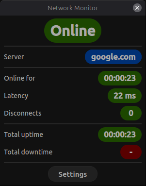
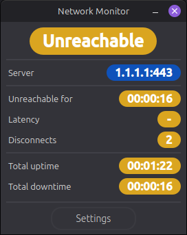
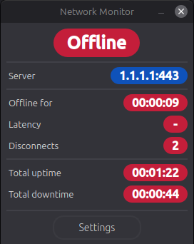

# Network Monitor

Desktop Python application (PySide6) that monitors **reachability of a target** via TCP and tracks network metrics.
When the target can't be reached, it uses a **fallback probe** to distinguish "no internet connectivity" from "target not reachable".

## Screenshots

### Online
<p align="center">
    
</p>

### Unreachable
<p align="center">
    
</p>

### Offline
<p align="center">
    
</p>

# How It Works

The app performs a TCP connection attempt to a configured target:

- **Online**: Target reachable
- **Unreachable**: Target not reachable, but a known-good endpoint is reachable (internet is stable, target is the issue)
- **Offline**: Target and known-good endpoints are unreachable (most likely no internet connectivity)

Latency is measured as the TCP connect time (when `Online`).

## Features

- Three status states: **Online / Offline / Unreachable**
- Configurable target endpoint:
    - IP Addresses (IPv4/IPv6)
    - Hostnames (e.g., `google.com`)
    - URLs (e.g., `https://www.google.com/`) - Normalized to host:port
- Configurable check interval and timeout (preset radio buttons and optional custom values)
- Metrics:
    - Server (target)
    - Phase: **Online for / Offline for / Unreachable for**
    - Latency (when `Online`)
    - Disconnect count
    - Total uptime / Total downtime
- Visual Indicators via `QSS`:
    - Status pill styling for all three states (Online/Offline/Unreachable)
    - Server pill remains blue
    - Severity styling for latency and disconnects
- Status tooltip (hover) with detailed information

## Tech Stack

- Python 3.11+
- PySide6 (Qt for Python)
- Background worker thread for network checks
- QSettings for persisted configuration
- QSS for styling

## Project Structure

```text
.
├── assets
│   └── screenshots
│       ├── offline.png
│       ├── online.png
│       └── unreachable.png
├── pyproject.toml
├── README.md
└── src
    └── network_monitor
        ├── app.py
        ├── __init__.py
        ├── __main__.py
        ├── monitor
        │   ├── __init__.py
        │   └── thread.py
        ├── state.py
        └── ui
            ├── __init__.py
            ├── main_window.py
            ├── monitor_view.py
            ├── settings_dialog.py
            └── styles
                ├── app.qss
                └── __init__.py
```

## Setup

### Option A: uv (Recommended)

```bash
uv venv
uv pip install -e .
```

### Option B: venv & pip

```bash
python -m venv .venv
source .venv/bin/activate
pip install -e .
```

## Run

```bash
network-monitor
```

Alternatively, run it as a module:
```bash
python -m network_monitor
```

## Roadmap

- [x] Configurable endpoint (host:port) and interval/timeout
- [x] Multiple state connectivity: Online/Offline/Unreachable
- [x] UI polish (layout and visual indicators)
- [ ] Disconnect debounce (reduce false disconnects)
- [ ] Start / Stop monitoring controls
- [ ] Latency statistics (min/avg/max over last N checks)
- [ ] History Viewing (recent checks table)
- [ ] Tooltips for all metrics (more detailed informations)

## Bugs (fixed)

- [x] Statistics keep resetting on status change (fixed in [0.3.1](#031))
- [x] Disconnects aren't being incremented/tracked (fixed in [0.3.2](#032))
- [x] When changing interval checks and timeout checks, the current phase resets (fixed in [0.4.0](#040))

## Changelog
### 0.1.0
Initial working GUI with TCP connectivity checks (`1.1.1.1:443`) and basic network statistics.

### 0.2.0
Added a settings dialog to configure the monitoring endpoint:
- Server IP
- Port

Added selectable monitoring parameters:
- Check interval (preset radio buttons and optional custom values)
- Timeout (preset radio buttons and optional custom values)

Settings persist between launches.

### 0.3.0
Fixed an issue where configurations weren't persistent.

Improved UI
- Metric rows
- Statistics are now in green, pills
- Tightened the spacing surrounding the settings button and status

### 0.3.1
Fixed issue where the metrics were being reset to default when changing settings.

### 0.3.2
Fixed issue where disconnects wasn't functioning properly.

### 0.3.3
Disconnect severity coloring:
- 0: Green
- 1 - 9: Yellow
- 10+: Red

### 0.3.4
Similar to [0.3.3](#033), latency severity coloring:
- <100ms: Green
- 100 - 199ms: Yellow
- 200+ms: Red

### 0.3.5
Layout refactor and additional UI polishing.

### 0.4.0
Fixed issue where the uptime/downtime was resetting when changing endpoints.
- Phase timers are now preserved on setting change

### 0.5.0
Added a third connectivity state: `Unreachable`
- Uses a fallback probe to distinguish `Offline` (no internet connectivity) from `Unreachable` (internet is stable, target is the issue)

Settings now accepts three methods of endpoints
- IP Addresses (IPv4/IPv6)
- Hostnames (`google.com`)
- URLs (e.g., `https://www.google.com/`)

Updated UI and styling to support the **Server Unreachable** state 

Added a status tooltip (hover) with extra details
